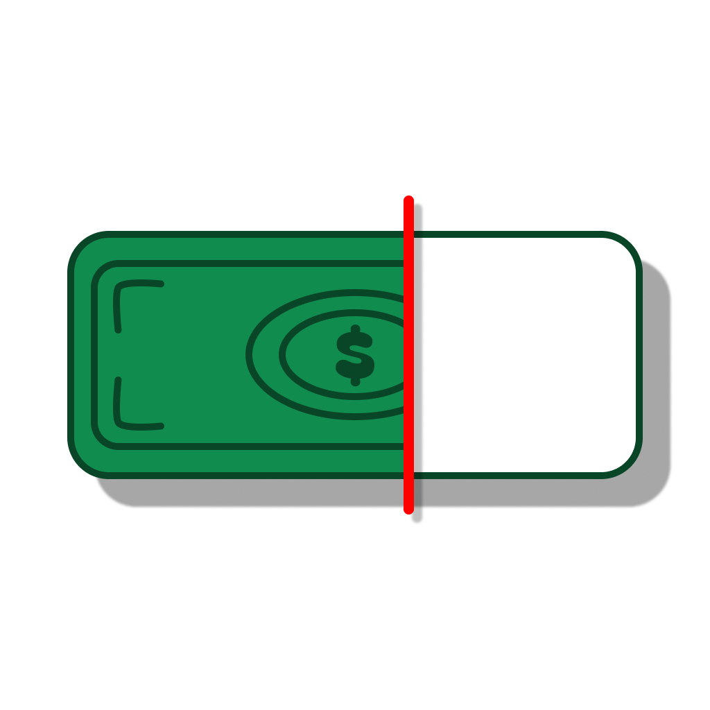

#  Green Bar

> **Give Every Rupee a Job. Keep the Bar Green.**

<div align="center">
  
  <br/>
  <i>Zero-Based Budgeting, Reimagined as a Game.</i>
  <br/>
  <a href="#vision"><strong>Explore the Vision</strong></a> ·
  <a href="#how-it-works"><strong>How It Works</strong></a> ·
  <a href="#getting-started"><strong>Get Started</strong></a> ·
  <a href="CONTRIBUTING.md"><strong>Contribute</strong></a>
</div>

<br/>

##  The Vision

Most finance apps are just digital receipts—they guilt-trip you about money you've already spent without helping you change your habits. 

**Green Bar** takes a radically different approach: **Zero-Based Budgeting with gamification.**
Instead of looking backward, you look forward. You start by putting all your available liquid money into your *Personal Corpus*, and then you assign every single rupee to a specific job. When your money has a clear mission, accidental overspending simply disappears.

We believe tracking expenses shouldn't be a chore—it should be a game you want to win. 

##  How It Works

Green Bar breaks down your finances into three simple, manageable pillars:

### 1.  The Personal Corpus *(Your Headquarters)*
All your liquid money starts here. When payday hits, your Corpus fills up. Distribute funds to your expenses, or "Lock" a portion out of sight for emergencies. 

### 2.  Variable Expenses *(Play the Game)*
Set strict limits for day-to-day spending (e.g., groceries, fuel, Swiggy orders). Every time you log an expense, your health drops. Your only goal? **Keep the bar from turning red.**

### 3.  Fixed Expenses *(Set It & Forget It)*
Rent, EMIs, and subscriptions are isolated into a simple checklist. Secure the exact amount needed and mark them as Paid. No progress bars here—just absolute peace of mind.

##  Features

- **Mobile-First Experience**: Designed as a Progressive Web App (PWA). Add it to your home screen for a lightning-fast, native app experience—no app store downloads needed.
- **Gamified Tracking**: Visual health rings and progress bars make managing limits incredibly intuitive and satisfying.
- **Secure & Synced**: Backed by Supabase, your data syncs securely across all your devices in real-time.
- **Beautiful UI**: Modern, dark-mode-first aesthetics utilizing glassmorphism and subtle micro-animations. 

##  Tech Stack

- **Frontend Framework:** [SvelteKit](https://kit.svelte.dev/)
- **Styling:** [Tailwind CSS](https://tailwindcss.com/)
- **Icons:** [Lucide Svelte](https://lucide.dev/icons/)
- **Backend / Database:** [Supabase](https://supabase.com/)

##  Getting Started

### Prerequisites
Make sure you have [Node.js](https://nodejs.org/) installed on your machine. You will also need a Supabase project set up. We are working upon making the supabase config available here, for developers to be able to run it in docker container locally. Please keep checking the repository for the latest updates.

### Installation

1. **Clone the repository:**
   ```bash
   git clone https://github.com/SaurabhM-24/Green-Bar.git
   cd Green-Bar/frontend
   ```

2. **Install dependencies:**
   ```bash
   npm install
   ```

3. **Set up Environment Variables:**
   Create a `.env` file in the `frontend` directory and add your Supabase credentials:
   ```env
   PUBLIC_SUPABASE_URL=your_supabase_url
   PUBLIC_SUPABASE_ANON_KEY=your_supabase_anon_key
   ```

4. **Run the Development Server:**
   ```bash
   npm run dev
   ```
   Open `http://localhost:5173` in your browser.

##  Contributing

We welcome contributions from fellow developers! Whether it's adding new features, improving the UI, or squashing bugs, your help is appreciated.

Please read our [Contributing Guidelines](CONTRIBUTING.md) for details on our code of conduct and the process for submitting pull requests.

##  Author

**Designed and built by Saurabh Mishra**
- [GitHub](https://github.com/SaurabhM-24)
- Feel free to reach out if you share the same passion for intuitive finance apps!

##  License

This project is licensed under the MIT License - see the [LICENSE](LICENSE) file for details.
