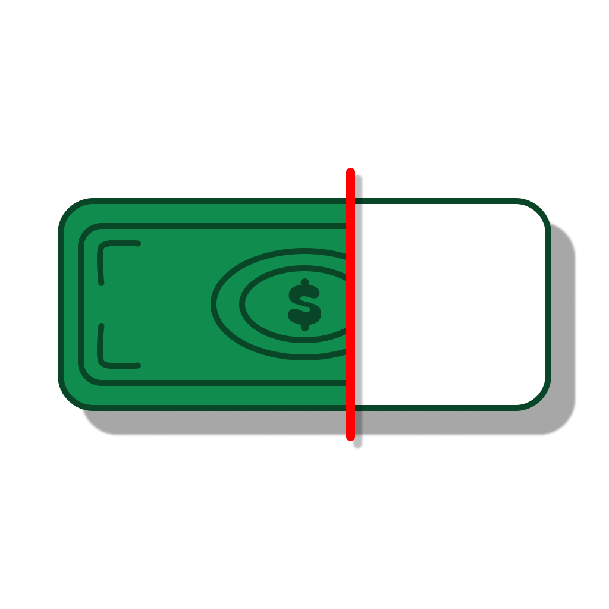
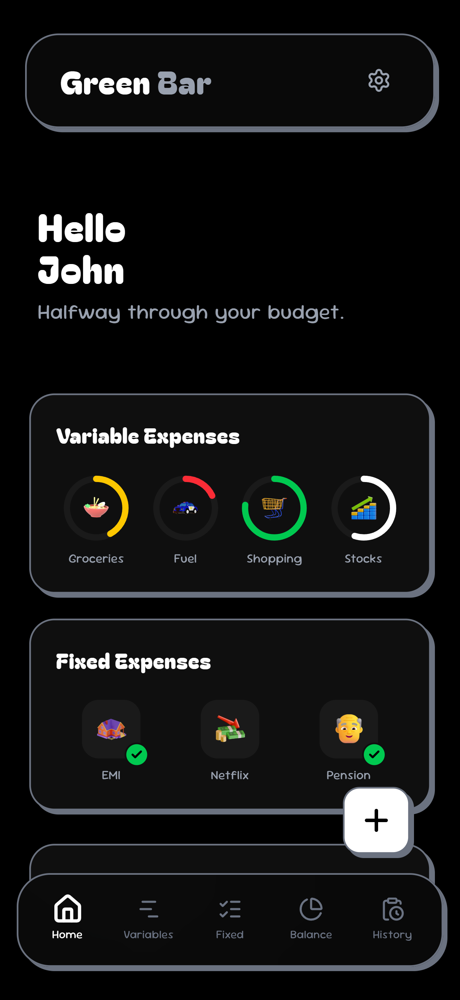
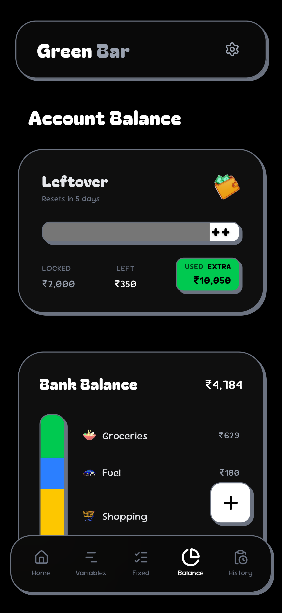
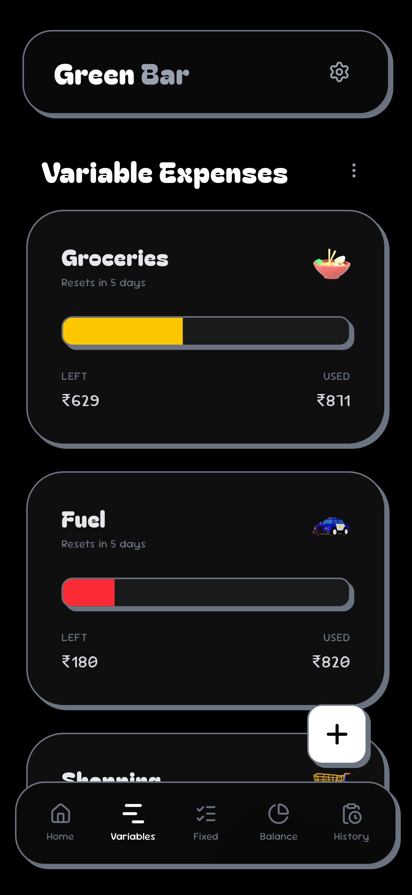
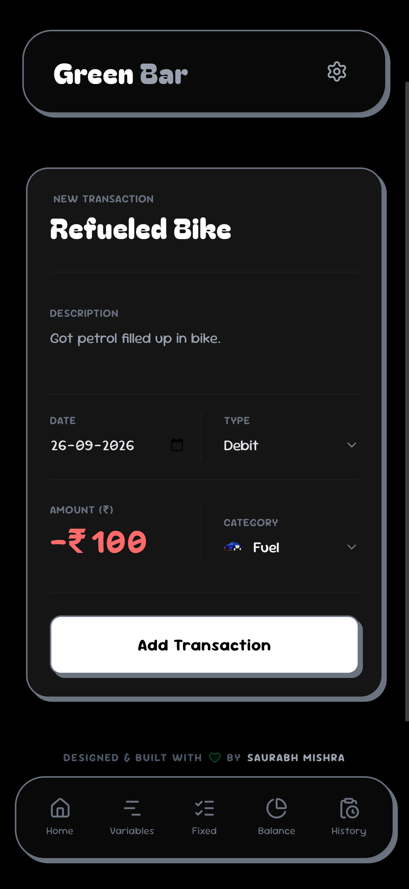
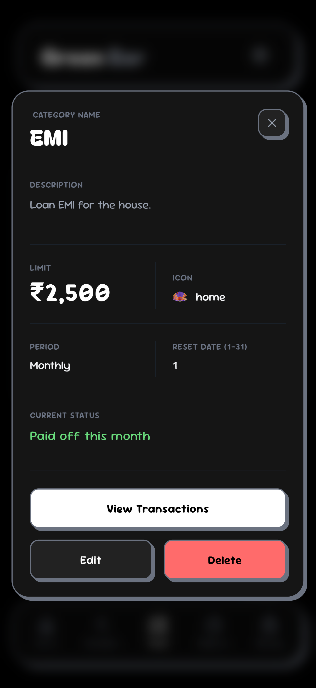
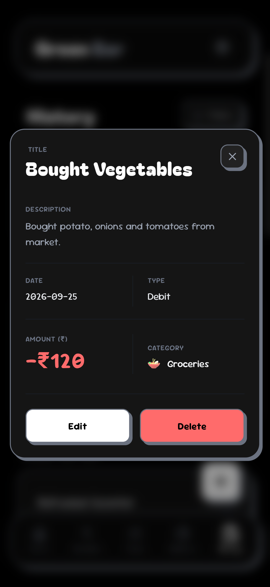
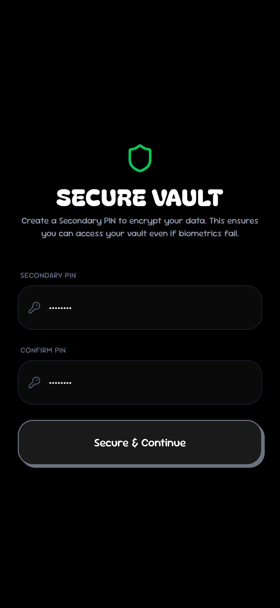
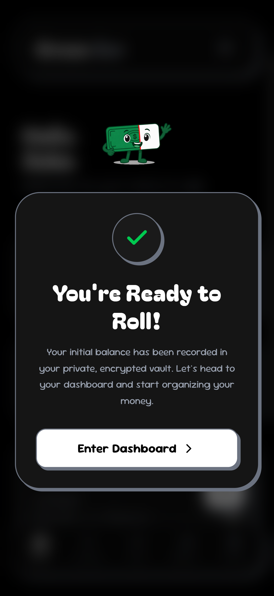

# 🟢 Green Bar

> **Give Every Rupee a Job. Keep the Bar Green.**  
> A mobile-first, zero-based budget tracker engineered with **client-side zero-knowledge encryption**, **WebAuthn biometric authentication**, and **gamified financial control**.

<div align="center">
  
  <br/>
  <br/>

  [](https://kit.svelte.dev/)
  [](https://svelte.dev/)
  [](https://tailwindcss.com/)
  [](https://w3c.github.io/webauthn/#prf-extension)
  [](https://developer.mozilla.org/en-US/docs/Web/API/SubtleCrypto)
  [](https://supabase.com/)
  [](LICENSE)

  <br/>

  <a href="https://greenbar.saurabhmishra.dev"><strong>🌐 Try Live App</strong></a> ·
  <a href="#-architecture--zero-knowledge-cryptography"><strong>🔒 Zero-Knowledge Security</strong></a> ·
  <a href="#-how-it-works-the-three-pillars"><strong>💡 How It Works</strong></a> ·
  <a href="#-visual-tour--app-screenshots"><strong>📱 Screenshots</strong></a> ·
  <a href="#-local-development"><strong>🛠️ Local Setup</strong></a> ·
  <a href="CONTRIBUTING.md"><strong>🤝 Contribute</strong></a>
</div>

---

## ⚡ The Vision: Budgeting, Reimagined

Most personal finance apps act as **digital receipts**—they retroactively track what you've already spent, show depressing red charts, and guilt-trip you after the damage is done. Worse yet, many free financial apps monetize your spending habits by selling transaction data to third-party advertisers or loan providers.

**Green Bar solves both problems with two uncompromising principles:**

1. **Zero-Based Budgeting (ZBB) with Gamification**: Instead of looking backward, you allocate every rupee upfront before spending it. Accidental overspending disappears because every rupee has a specific mission.
2. **Absolute Privacy via Client-Side Encryption**: Your finances are nobody else's business. All budget limits, transaction amounts, and descriptions are encrypted with **AES-256-GCM** inside your device's browser memory before ever reaching the cloud database. Only you hold the biometric or PIN key.

---

## 🔒 Architecture & Zero-Knowledge Cryptography

Green Bar implements a true **zero-knowledge, client-side encrypted architecture**. Neither the server hosting the app, nor Supabase, nor the database administrator can view your balances or purchases.

```
┌────────────────────────────────────────────────────────────────────────┐
│ USER'S DEVICE (Client Browser)                                         │
│                                                                        │
│   Touch ID / Face ID / PIN                                             │
│            │                                                           │
│            ▼                                                           │
│    WebAuthn PRF / PBKDF2 ──► Key Encryption Key (KEK)                  │
│                                    │                                   │
│                                    ▼ Decrypts                          │
│                           Data Master Key (DMK)                        │
│                           [Held purely in RAM]                         │
│                                    │                                   │
│             ┌──────────────────────┴──────────────────────┐            │
│             ▼ Encrypt                                     ▼ Decrypt    │
│   Plaintext Transactions                         Decrypted Dashboard   │
│   (₹ amounts, categories)                         (Sums & Progress)    │
│             │                                             ▲            │
└─────────────┼─────────────────────────────────────────────┼────────────┘
              │ AES-256-GCM Ciphertext                      │ Base64 IV + Ciphertext
              ▼                                             │
┌────────────────────────────────────────────────────────────────────────┐
│ SUPABASE BACKEND (PostgreSQL Cloud)                                    │
│   Stores ONLY scrambled blobs: "r9K2...:b1Z0..."                        │
│   [Zero Plaintext Financial Data Stored in Database]                   │
└────────────────────────────────────────────────────────────────────────┘
```

### Cryptographic Building Blocks

- **Data Master Key (DMK)**: A symmetric AES-256-GCM key generated once per user upon registration. It encrypts all sensitive application data (`amount`, `category`, `limit_amount`, `title`, `description`).
- **WebAuthn PRF (Pseudo-Random Function)**: When logging in with Passkeys/Biometrics (Touch ID, Face ID, Windows Hello), the hardware authenticator deterministically derives the **Key Encryption Key (KEK)** from a public salt without ever exposing biometric credentials.
- **Hardware-Isolated Decryption**: The KEK decrypts the encrypted DMK payload into device memory (`cryptoStore.svelte.js`). The raw DMK is **never persisted** to `localStorage`, `sessionStorage`, or cookies.
- **Secondary Hardware PIN**: A deterministic PBKDF2/WebCrypto key derivation mechanism allows secure multi-device unlock on secondary browsers where WebAuthn Passkeys aren't yet synced.
- **Client-Side Reactive Aggregation**: Because monetary amounts are stored as ciphertexts, PostgreSQL cannot run `SUM()` queries. All period aggregations, health percentages, and balance derivations are computed client-side in real time using reactive Svelte 5 modules (`src/lib/data.svelte.js`).

---

## 💡 How It Works: The Three Pillars

Green Bar structures your financial life into three distinct, intuitive pillars:

### 1. 🏦 The Leftover / Personal Corpus *(Your Headquarters)*
All your liquid money starts in one central reservoir. When your paycheck or income arrives, your Leftover fills up. From this central vault, you assign funds to your obligations and daily limits.
- **Emergency Fund Locking**: Want to preserve a reserve cushion? Simply "Lock" a portion of your Leftover. Locked funds stay strictly invisible from your day-to-day spending calculations so you're never tempted to spend them.

### 2. 🟢 Variable Expenses *(Play the Game)*
Fluid day-to-day spending (dining out, coffees, groceries, shopping). You set a strict limit for each category.
- Every transaction fills the progress bar.
- Your single monthly objective? **Keep the bar green.**

### 3. ✅ Fixed Expenses *(Set It, Tick It, Forget It)*
Rent, EMIs, utilities, and recurring subscriptions don't need daily progress bars.
- Isolated into a clean monthly checklist.
- Ring-fence the exact money needed upfront so your bills are guaranteed before you spend a single rupee on fun. Mark them as Paid with one tap.

---

## 📱 Visual Tour & App Screenshots

| 1. Home Dashboard | 2. Leftover / Corpus Management |
| :---: | :---: |
|  |  |
| *Real-time financial health ring, liquid balance, and live variable expense meters.* | *Payday liquid pooling, category distribution, and emergency fund locking.* |

| 3. Gamified Variable Tracking | 4. Quick Transaction Entry |
| :---: | :---: |
|  |  |
| *Intuitive progress bars: stay under the limit to keep the bar green.* | *Log any expense in under 3 seconds with auto-categorization and encryption.* |

| 5. Fixed Expenses Checklist | 6. Encrypted Transaction History |
| :---: | :---: |
|  |  |
| *Isolate non-negotiable bills, mark them as Paid, and ring-fence obligations.* | *Decrypted client-side on the fly with chronological filtering and card view.* |

| 7. Biometric & PIN Security Gate | 8. PWA Mobile Web Experience |
| :---: | :---: |
|  |  |
| *Zero-knowledge gate: unlock with Face ID, Touch ID, Passkey, or Secondary PIN.* | *Install instantly as a PWA—no app store bloat or forced background updates.* |

---

## 🛠️ Tech Stack & Engineering Highlights

| Layer | Technologies | Rationale |
| :--- | :--- | :--- |
| **Framework** | **SvelteKit 2 + Svelte 5** | Cutting-edge Svelte 5 Runes (`$state`, `$derived`, `$props`) deliver instantaneous reactivity with virtually zero bundle runtime overhead. |
| **Styling** | **Tailwind CSS v4** | Next-generation CSS engine paired with a signature **Rounded Neo-Brutalist** aesthetic (`Bagel Fat One` display font, `Sour Gummy` body font, `box-3d` pop shadows). |
| **Cryptography** | **Web Crypto API + WebAuthn PRF** | Native browser crypto engine (SubtleCrypto: AES-256-GCM, PBKDF2) combined with hardware biometric authenticator extensions. |
| **Backend & Auth** | **Supabase (PostgreSQL + RLS)** | Reliable relational database with strict Row Level Security (RLS) policies protecting ciphertext records. |
| **Icons & UI** | **Lucide Svelte** | Lightweight, accessible SVG icon library. |
| **PWA** | **Service Workers & Web App Manifest** | Add to Home Screen on iOS & Android for native app feel, full-screen viewport, and offline caching. |

---

## 📂 Codebase Tour

```
frontend/
├── src/
│   ├── app.css                      # Tailwind v4 theme, fonts, and neo-brutal box-3d utilities
│   ├── app.html                     # HTML shell loading 'Bagel Fat One' and 'Sour Gummy' fonts
│   ├── lib/
│   │   ├── crypto.js                # Core WebCrypto & WebAuthn PRF cryptographic utilities
│   │   ├── cryptoStore.svelte.js    # Svelte 5 in-memory DMK key lifecycle manager
│   │   ├── data.svelte.js           # Client-side data fetching, decryption & aggregation engine
│   │   ├── supabase.js              # Supabase client instantiation
│   │   ├── components/
│   │   │   ├── EncryptionGate.svelte # Biometric / PIN unlock overlay gate
│   │   │   ├── Header.svelte        # Authenticated dashboard header with profile & vault status
│   │   │   ├── NavBar.svelte        # Mobile-first bottom navigation bar
│   │   │   ├── HealthRing.svelte    # Gamified circular financial health score visualizer
│   │   │   ├── CategoryCard.svelte  # Variable expense progress bar card
│   │   │   ├── CorpusCard.svelte    # Liquid balance and emergency fund card
│   │   │   ├── FixedItem.svelte     # Bill checklist item with paid status toggle
│   │   │   ├── Footer.svelte        # Branded neo-brutalist footer
│   │   │   └── editCards/           # Modal edit views for budgets, corpus, and transactions
│   └── routes/
│       ├── +layout.svelte           # Root layout mounting auth & encryption gates
│       ├── +page.svelte             # Primary dashboard (Home view)
│       ├── balance/                 # Leftover / Corpus management route
│       ├── variable/                # Variable expenses overview & detailed cards
│       ├── fixed/                   # Fixed expenses checklist route
│       ├── list/                    # Decrypted transaction history route
│       ├── add/                     # Rapid expense entry route
│       ├── login/                   # Authentication & registration route
│       └── landing/                 # Mobile-first landing page with phone mockups & guides
└── static/
    ├── icon-192x192.png             # PWA app icons
    ├── icon-512x512.png
    ├── manifest.json                # Web App Manifest for native PWA installation
    └── screenshots/                 # High-resolution mobile app screenshots
```

---

## 🚀 Local Development

### Prerequisites
- **Node.js**: v20 or higher recommended.
- **npm**: v10 or higher.
- A **Supabase** account (or local Supabase CLI instance).

### 1. Clone the Repository
```bash
git clone https://github.com/SaurabhM-24/Green-Bar.git
cd Green-Bar/frontend
```

### 2. Install Dependencies
```bash
npm install
```

### 3. Configure Environment Variables
Create a `.env` file inside the `frontend/` directory:
```env
PUBLIC_SUPABASE_URL=https://your-project.supabase.co
PUBLIC_SUPABASE_ANON_KEY=your-supabase-anon-key
```

### 4. Run the Development Server
```bash
npm run dev
```
Open [http://localhost:5173](http://localhost:5173) in your browser. To view the landing page directly, navigate to [http://localhost:5173/landing](http://localhost:5173/landing).

### 5. Code Quality & Type Checks
```bash
# Svelte diagnostics and type-checking
npm run check

# Code formatting & linting
npm run lint

# Production build verification
npm run build
```

---

## 🌐 Deploying to Production

Green Bar can be hosted on any modern static/SSR web host (Vercel, Cloudflare Pages, Netlify, or self-hosted Node server):

```bash
npm run build
```
The output will be generated via `@sveltejs/adapter-auto`.

---

## 🤝 Contributing

Contributions, bug reports, and suggestions are warmly welcomed! Green Bar is 100% open source and community-driven.

1. Fork the Project.
2. Create your Feature Branch (`git checkout -b feature/AmazingFeature`).
3. Commit your Changes (`git commit -m 'Add some AmazingFeature'`).
4. Push to the Branch (`git push origin feature/AmazingFeature`).
5. Open a Pull Request.

Please review our [Contributing Guidelines](CONTRIBUTING.md) before opening a pull request.

---

## 👤 Author & Acknowledgments

**Crafted with ❤️ by Saurabh Mishra**
- **GitHub**: [@SaurabhM-24](https://github.com/SaurabhM-24)
- **Live Project**: [greenbar.saurabhmishra.dev](https://greenbar.saurabhmishra.dev)

---

## 📄 License

This project is open source and available under the [MIT License](LICENSE).
